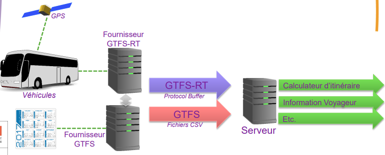

## Recherche sur les données GTFS

## **1. Recherche préalable** 

### *Historique*
General Transit Feed Specification permet de communiquer sur les données des horaires de transports en commun. Est présent des données comme les emplacements des arrêts, des tracés de lignes. 
GTFS est conçu originellement par Bibiana McHugh, responsable SI chez TriMet, qu’est l’autorité organisatrice des transports urbains de l’agglomération de Portland en collab avec Google initialement nommé Google Transit Feed Specification

C’est une base de données relationnelle, qui permet, grâce à des arrêts, des lignes et des trajets à identifiants uniques, de modéliser des itinéraires dans des applications de transports, de gérer le réseau et mettre à jour les horaires, et un grand nombre d’autres usages

Informations sur le format 
format conçu par Google  → Flux GTFS

Format : 
 (Données Statique)GTFS Schedule : format contenant les infos sur les itinéraires, les horaires, le tarif etc..  sous forme d’un fichier txt un format simple. Archives Zip (fichiers CSV et txt)
(Donnée Temps Réel)GTFS Realtime :  format contenant mise à jour des trajets, positions, et les alertes de service (arrêts déplacés, événements imprévus affectant une station, un itinéraire ou l'ensemble du réseau).

### *Structuration des données*

En statique :\
\_\_\_\_\_\_\_\_\_\_\_\_\_

Les données sont écrites au format .txt et structurées selon un *MCD* de référence standardisé \
Puis elles sont rassemblées dans un ZIP

En temps réel :\
\_\_\_\_\_\_\_\_\_\_\_\_\_\_\_\_
Utilisation de l'API 

### *Principaux fichiers*
Un fichier par type de données : arrêts, calendriers, horaires, itinéraires, agences

 (*O : Obligatoire F : Facultatif*)
- O  agency.txt regroupe les informations sur le service de transport (compagnies de transport, nom du réseau)
- O calendar.txt et  F calendar_dates.txt qui contiennent le calendrier de circulation
- O  routes.txt présente le nom et la direction des routes (au sens d'une origine-destination)
- O  stops.txt liste tous les points d'arrêt et propose d'éventuelles informations
- O  trips.txt détaille les courses, sous la forme d'une table de liaison entre les services (agency), les routes et les régimes de circulation (calendar.txt et calendar_dates.txt)
- O stops_times.txt présente les horaires des courses aux points d'arrêt
- F transfers.txt présente les correspondances entre plusieurs points d'arrêt
shapes.txt permet le tracé d'une route sur une carte
- F frequencies.txt indique le temps entre deux courses d'une ligne (pour celles qui n'ont pas d'horaires fixes aux points d'arrêts)
- F fare_attributes.txt , fare_rules , shapes.txt , feed_infos.txt
lien.

### *Contenu*
Informations sur les agences de transport, les itinéraires, les arrêts, les horaires, les voyages, les tarifs et d'autres éléments essentiels pour comprendre et utiliser un système de transport en commun.

## MCD GTFS

## **2. Exemples**

lien exemple : https://developers.google.com/transit/gtfs/examples/gtfs-feed?hl=fr

### *Quels sont les principaux fichiers composant un ensemble de données GTFS ?* 
Fait au dessus

### *Quel est le but de chaque fichier GTFS ?*
(Soutenir une plus grande interopérabilité des données de transport en commun)\
Améliorer l'expérience de l'utilisateur final dans les applications de transport public.\
Faciliter le déploiement et la mise à l'échelle des applications, produits et services par les développeurs de logiciels.\
(Faciliter l'utilisation de GTFS dans diverses catégories d'applications (au-delà de son objectif initial de planification des trajets)
### *Quels sont les types d'informations qui peuvent être trouvés dans un fichier GTFS ?*
Horaires théoriques : Informations sur les itinéraires, les horaires, les tarifs et les détails géographiques des transports publics.\
Mise à jour des trajets : Données en temps réel sur les retards, les annulations, les itinéraires modifiés.\
Alertes de service : Informations sur les arrêts déplacés, les événements imprévus affectant une station, un itinéraire ou l'ensemble du réseau.\
Positions des véhicules : Détails sur les véhicules, y compris leur emplacement et le niveau de congestion.\
Ces informations variées permettent aux utilisateurs d'accéder à des données actualisées sur les horaires, les trajets et les services de transport en commun, améliorant ainsi leur expérience et leur planification lors de leurs déplacements

### *Comment les données GTFS sont-elles utilisées dans les applications de transport en commun ?*
Pour la planification des trajets : planifier les déplacements en fonction des temps de trajet etc\
Pour l’affichage des horaires : Afficher les retards éventuels et connaître les futurs passages.\
Suivi des véhicules : Connaître en temps réel la position des transports en commun pour estimer le temps d’attente et d’arrivée.\
Alertes de services : Permet les usagers des transports en commun d’éventuels incidents, des travaux ou événements spéciaux.

### *Quels sont les avantages et les limites du format GTFS ?*
Maintenir les données dans le temps , actualisation peut être un frein 
Mise à jour  régulière 
qui corrige? qui entre les données ? qui actualise ? qui publie ?

Mon seul avantage est de travailler avec Margaux la nigaut <3 

## 3. Analyse des données GTFS RealTime

Nous avons choisi les données de Angers Métropoooole !!! 
en **RealTime** grâce à son Api.\
Nous avons téléchargé les données en one-shot pour visualiser les résultats

### *Informations clés*
- Plusieurs données s'offrent à nous, obligatoires et facultatives
- Deux (2) avec une géométrie (MULTIPOINT) (shapes.txt et stops.txt)
- Les attributs des différentes données sont de types 
  - Booléens (0 ou 1) 
  - Text
  - Décimal 
  - DateTime
- Notre données comporte des tables dites facultatives, qui nous permettent d'avoir une connaissance plus fine sur les horaires de passage (calendar_dates.txt) 
-  En se référant au MCD nous avons pu créer des jointures sur les différentes couches 

A la différence des **GTFS schedules**, nous avons accès aux données en temps réel permettant d'avoir des informations en direct sur les trajets référencés.
Les **GTFS RealTime** nous permet d'avoir la position exacte des véhicules de transport en commun, la mise à jour des trajets et les alertes de service

### *Structuration des données GTFS-rt*
**Le fichier général :** gtfs-realtime.proto

Défini la structure des données et des messages pour les flux\
Utilise un code source qui permet de lire les données\
Synchronise avec les gtfs-static 

**Plusieurs informations disponibles :**

Vehicle Positions - Position du véhicule : Indique la position géographique actuelle d'un véhicule en mouvement. (latitude, longitude, vitesse, direction, etc)

Trip Updates - Mise à jour de trajet : Informations sur l'état actuel d'un trajet spécifique. (retards, avances, changements d'itinéraire,  temps d'attente prévus aux arrêts, etc.)

Informations sur les arrêts : Indiquent les prochains arrêts prévus pour un véhicule donné. (l'heure estimée d'arrivée,  retards éventuels,  informations sur les plateformes, etc.)

Service Alerts - Alertes : Informations sur les perturbations ou les alertes qui pourraient affecter le service de transport en commun. (fermetures de routes, retards généralisés, pannes de véhicules, travaux de maintenance, etc.)

