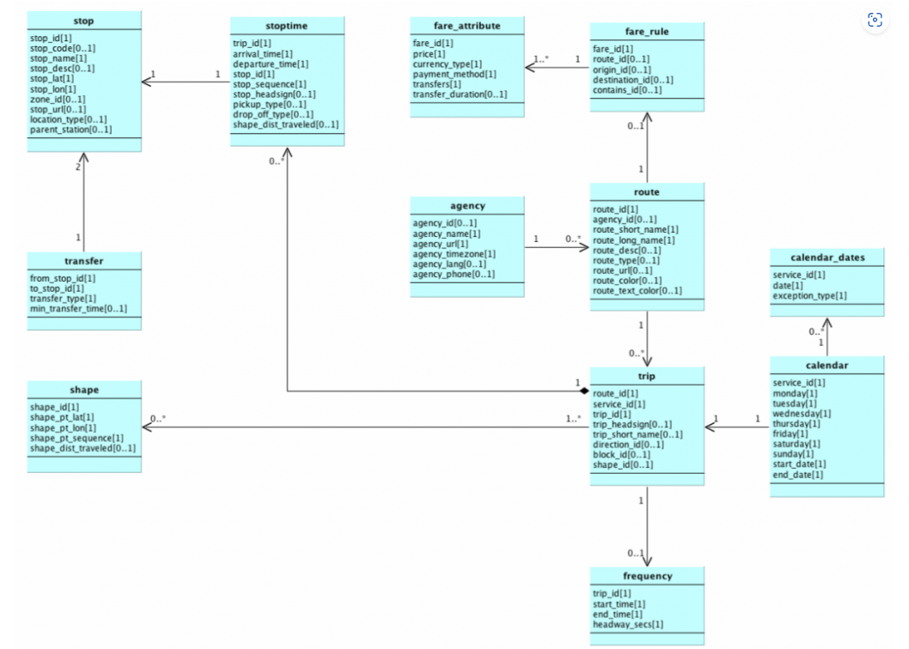

# Rapport GTFS

Site officiel : https://gtfs.org/

Il existe un validateur pour s'assurer de la conformité des fichiers au standard : https://gtfs-validator.mobilitydata.org/

Historique:
Le standard GTFS a été créé sous l'impulsion du président Obama dans l'initiative de l'open data.
Le GTFS a été déployé dans la ville de Portland (Oregon) ou il fût créé avec le partenariat de Trimnet et de Google. Le but de l'uniformisation de la donnée est de formater les flux relatifs aux transports en commun pour optimiser la communication des horaires de transport et le intéractions géographiques associées.
Le standard a eu la vocation a se déployer, a partir de 2006 a 5 villes des états-unis. Actuellement, 100 opérateurs aux états unis et 400 dans le monde utilisent ce standard pour communiquer leurs informations. 

# 1. Le standard GTFS Schedule : 
## Ses caractéristiques principales :
Fonctionne sur la base de simples fichiers texte normés dont le formatage est similaire au CSV. 
Fonctionnellement il s'agit d'une base de données sans 

1. Schedule : statique, fonctionne sur la base d'un simple fichier texte normé dont le formatage est similaire au CSV
Référence : https://gtfs.org/schedule/reference/

    Constitué des fichiers suivants :
    * agency.txt 
        * requis
        * Transit agencies with service represented in this dataset.
    * stops.txt 
        * requis
        * Stops where vehicles pick up or drop off riders. Also defines stations and station entrances.
    * routes.txt 
        * requis
        * Transit routes. A route is a group of trips that are displayed to riders as a single service.
    * trips.txt 
        * requis
        * Trips for each route. A trip is a sequence of two or more stops that occur during a specific time period.
    * stop_times.txt 
        * requis
        * Times that a vehicle arrives at and departs from stops for each trip.
    * calendar.txt 
        * requis conditionnel
        * Service dates specified using a weekly schedule with start and end dates. 
    * calendar_dates.txt 
        * requis conditionnel
        * Exceptions for the services defined in the calendar.txt. 
    * fare_attributes.txt 
        * optionnel
        * Fare information for a transit agency's routes.
    * fare_rules.txt 
        * optionnel
        * Rules to apply fares for itineraries.
    * timeframes.txt 
        * optionnel
        * Date and time periods to use in fare rules for fares that depend on date and time factors.
    * fare_media.txt 
        * optionnel
        * To describe the fare media that can be employed to use fare products. 
    * fare_products.txt 
        * optionnel
        * To describe the different types of tickets or fares that can be purchased by riders.
    * fare_legs_rules.txt 
        * optionnel
        * Fare rules for individual legs of travel.
    * fare_transfer_rules.txt 
        * optionnel
        * Fare rules for transfers between legs of travel.
    * areas.txt 
        * optionnel
        * Area grouping of locations.
    * stop_areas.txt 
        * optionnel
        * Rules to assign stops to areas.
    * networks.txt 
        * interdit conditionnel
        * Network grouping of routes.
    * route_networks.txt 
        * interdit conditionnel
        * Rules to assign routes to networks.
    * shapes.txt 
        * optionnel
        * Rules for mapping vehicle travel paths, sometimes referred to as route alignments.
    * frequencies.txt 
        * optionnel
        * Headway (time between trips) for headway-based service or a compressed representation of fixed-schedule service.
    * transfers.txt 
        * optionnel
        * Rules for making connections at transfer points between routes.
    * pathways.txt 
        * optionnel
        * Pathways linking together locations within stations.
    * levels.txt 
        * requis conditionnel
        * Levels within stations.
    * translations.txt 
        * optionnel
        * Translations of customer-facing dataset values.
    * feed_info.txt 
        * recommandé
        * Dataset metadata, including publisher, version, and expiration information.
    * attributions.txt 
        * optionnel
        * Dataset attributions.
 
# 2. Lecture et optimisation

# 3. Questions : 
* Quels sont les principaux fichiers composant un ensemble de données GTFS ?
    * OK
* Quel est le but de chaque fichier GTFS ? 
    * OK
* Quels sont les types d'informations qui peuvent être trouvés dans un fichier GTFS ? 
    * OK ?
* Comment les données GTFS sont-elles utilisées dans les applications de transport en commun ?
    * La composante Schedule permet d'afficher la structure du réseau, en "précalculé", alors que le Realtime permet d'afficher la position des transports, les incidents réseaux etc.
* Quelles sont les avantages et les limites du format GTFS ?

**Les avantages** :
* Il est très simple d’utilisation ce qui a favorisé son adoption.
**Les inconvénients** :
*
    
# 4. Les questions que l'on se pose :

* Le GTFS utilise une structure de base de données en fichiers txt
    * Pourquoi utiliser du txt plutot que du CSV ?
    * Pourquoi utiliser des fichiers plats plutot que se baser sur une techno existante ? (type SQLite) ?

# 5. Discussion en place :

* Intérêt à entreprendre des travaux de bdd pour la rendre compatible avec le standard

* avantages
    * intérabilité
    * utilisation d'outils web dédiés
    * open-data

* inconvénients 
    * Temps de création
    * But / rentabilité

# 6. Application pratique :

* Améliorer l'expérience client de l'utilisateur final dans les applications de transport public.
* Soutenir une large interopérabilité des données pour faciliter le déploiement et la mise à l'échelle des applications, produits et services par les développeurs de logiciels
* Faciliter l'utilisation du GTFS dans diverses catégories d'applications (au-delà de son objectif initial de planification des déplacements).
* Améliorer l'expérience de l'utilisateur final dans les applications de transport public.
